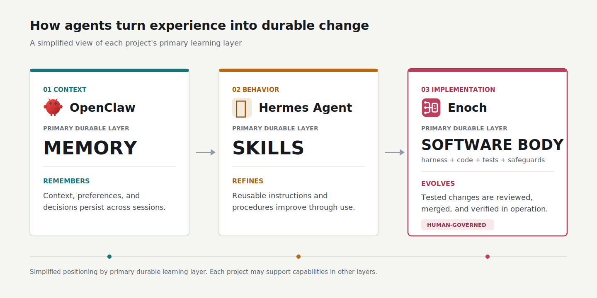
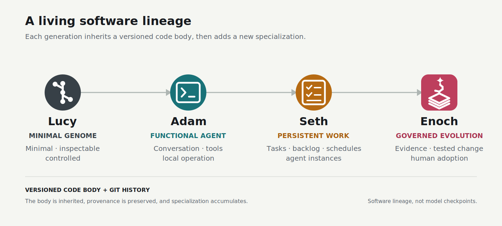

# Enoch

<p align="center">
  
</p>

<p align="center"><strong>Build your agent. Let her grow with you.</strong></p>

Enoch is a personal software agent you build for yourself. She lives in your
environment, works with your tools and repositories, and grows through your
shared history.

This repository is the reference implementation of the Our-Ark agent
architecture. It demonstrates governed code evolution: Enoch can turn feedback
and operational experience into tested, reviewable changes while you control
what is adopted. It is built for researchers, agent builders, and power users
who want to run or fork an agent body.

## Why Enoch Is Different

Memory changes what an agent remembers. Skills change how an agent works.
Enoch can evolve the governed code body that she is.

[OpenClaw](https://github.com/openclaw/openclaw) emphasizes persistent memory
and workspace skills. [Hermes Agent](https://github.com/NousResearch/hermes-agent)
adds a learning loop that creates and improves reusable skills. Enoch extends
durable learning into tested software changes.



She can identify limitations in her own operation, propose a bounded change to
the code that runs her, implement it in an isolated worktree, validate it, and
publish it for human review.

This is not unrestricted self-modification. Every evolution remains traceable
from evidence to candidate, task, pull request, human review and merge, and
verified adoption. Enoch can evolve her code while people retain authority over
what becomes part of the running agent.

## Lineage

Enoch belongs to a living software lineage:



Each generation inherits a versioned code body and Git history, then develops a
new specialization. This lineage describes software provenance, not model
checkpoints or a fictional family tree.

## Core Skills

| Skill | What Enoch can do |
| --- | --- |
| [`code`](src/enoch/skills/code/SKILL.md) | Inspect, modify, test, and explain changes to her local code body. |
| [`work`](src/enoch/skills/work/SKILL.md) | Run leased tasks in isolated worktrees through a queue, backlog, schedules, retries, and recovery. |
| [`evolve`](src/enoch/skills/evolve/SKILL.md) | Collect and rank improvement candidates, propose bounded self-evolution, and track work through human review, promotion, and adoption. |
| [`learn`](src/enoch/skills/learn/SKILL.md) | Adapt a published skill from another trusted Our-Ark agent instead of copying it blindly. |
| [`inherit`](src/enoch/skills/inherit/SKILL.md) | Discover direct-ancestor skills and changes for selective inheritance. |
| [`skill-library`](src/enoch/skills/skill-library/SKILL.md) | Package reusable, agent-neutral skill implementations as immutable libraries with thin adapters. |

The reference stack also includes `telegram-talk`, `telegram-vision`, and
`github` integration skills. They live outside the core agent body and can be
replaced with other provider packages. Run `/skills` on an active instance to
inspect its complete installed skill set.

## Requirements

- Python 3.11, 3.12, 3.13, or 3.14
- The tools and credentials required by the providers you select

## Reference Environment

Enoch's reference interactive deployment runs locally on a MacBook with
macOS, Codex, Telegram, Git, GitHub, and launchd. This is the environment used
to operate the original Enoch instance, not a fixed architectural requirement.
The test suite also runs on Linux, and a systemd user-service provider is
included.

| Capability | Reference provider | Replaceable with |
| --- | --- | --- |
| Chat | Telegram | Slack, Discord, another chat system, or a custom interface |
| Agent runtime | Codex CLI | Claude or another agent runtime |
| Version control | Git | Another version-control implementation |
| Code forge | GitHub | GitLab, Gitea, or another forge |
| Background service | launchd on macOS; systemd on Linux | Another process or service manager |

Enoch core depends on provider contracts rather than Telegram, GitHub,
launchd, or systemd directly. A portable deployment only needs to add `chat`
and `vcs` providers: Enoch supplies the Codex runtime and a local-only forge
fallback, while a background service manager is optional. Provider packages
can be added through the
`our_ark.providers` Python entry-point group and selected in the private
`.enoch/config.yaml` file, with `/config provider`, or with environment
variables. Add `runtime`, `forge`, or `service` providers only when the
built-in or foreground behavior is not sufficient.

The reference providers require a Codex CLI login, Git, GitHub CLI
authentication for publishing, Telegram credentials for chat, and either
launchd or a systemd user session for background operation.

## Quick Start

Clone the repository and start Enoch from its checked-out software body. The
core install does not install Telegram, GitHub, launchd, or systemd:

```bash
git clone https://github.com/our-ark/enoch.git
cd enoch
bin/enoch --help
bin/enoch
```

The launchers select a supported Python interpreter and keep runtime state,
downloaded dependencies, credentials, memories, and logs under ignored local
paths. Do not commit files from `.enoch/` or `.agent/instance.yaml`.

## Run

```bash
bin/enoch
```

## Telegram

Create a Telegram bot for Enoch:

1. Open `@BotFather` in Telegram.
2. Send `/newbot`.
3. Use `Enoch` as the bot name.
4. Choose a unique username, such as `genesis_enoch_bot`.
5. Copy the token from BotFather.

Configure and start the local Enoch instance:

```bash
cd /path/to/your/enoch-instance

bin/enoch setup token <token>
bin/enoch setup chat <your-chat-id>
bin/enoch-daemon start
```

Then open the bot in Telegram and send `/status`.

Use `/help` to see every Telegram command. Use `/help <command>` for detailed
usage and subcommands, for example `/help task` or `/help worktree`. `/start`
only shows this getting-started guidance inside Telegram; it does not start or
restart the local daemon. Core commands use the canonical singular forms shown
by `/help`; plural aliases such as `/tasks` and `/worktrees` are not registered.

Use `/worktree` to inspect task worktrees that Enoch preserved for debugging.
`/worktree show <task-id>` reports the branch, path, linked task records, and
changed files. `/worktree cleanup <task-id>` removes only a clean inactive
worktree and will keep a local branch that Git considers unmerged. `/worktree
discard <task-id> force` permanently removes an inactive worktree, all of its
uncommitted changes, and its local branch. Enoch refuses both operations while
the worktree is still used by a queued, running, paused, or retrying task.

## Codex configuration

Enoch has her own local runtime configuration in `.enoch/config.yaml`. For the
Codex model and reasoning effort, settings are resolved in this order:

1. `ENOCH_CODEX_MODEL` or `ENOCH_CODEX_REASONING_EFFORT`
2. `codex.model` or `codex.reasoning_effort` in `.enoch/config.yaml`
3. The user-level Codex configuration in `$CODEX_HOME/config.toml` (normally
   `~/.codex/config.toml`)
4. The Codex CLI default

Use `/config` in Telegram to inspect the effective settings and `/config model`
or `/config reasoning-effort` to change Enoch's local overrides.

The Codex executable is resolved independently in this order:

1. `ENOCH_CODEX_BIN`
2. `codex.executable` in `.enoch/config.yaml`
3. `codex` on `PATH`
4. Known Codex locations inside the ChatGPT or Codex macOS app

Use `/config runtime codex executable <path|auto>` to configure or restore
automatic discovery. The daemon reads this instance setting directly.

## Doctor

Run `bin/enoch doctor` or `/doctor` before publishing changes. Doctor reports
three separate sections:

- code health: Python, the complete test suite, and import smoke tests;
- environment readiness: the locked Python build backend required by the
  portable-install tests;
- operational readiness: Codex login, forge authentication, version-control
  workspace state, and durable `.enoch` state storage.

Doctor preserves the beginning and end of long failures so the final exception
is not lost. It validates existing JSON and JSONL state without replacing
unreadable files. When Doctor runs for an isolated task worktree, code checks
use that worktree while operational state checks use the resident Enoch
instance.

If the build-backend preflight fails, install the same locked prerequisite used
by CI:

```bash
python -m pip install --disable-pip-version-check --require-hashes \
  -r .github/requirements/test-build.txt
```

## Providers

Codex, Git, and a local-only forge are core defaults. Telegram, GitHub,
launchd, and systemd are reference provider packages under `libraries/`.
Installed Python packages can
add or replace chat, agent runtime, version control, code forge, and host
service providers through the `our_ark.providers` entry-point group. Select them
in `.enoch/config.yaml` or with `/config provider`. launchd is selected on
macOS; systemd user services are selected on Linux. Install the complete
reference stack with `pip install '.[reference]'` when working from a clone.

For a new environment, install provider packages exposing `chat.<name>` and
`vcs.<name>` entry points, then select only those two capabilities:

```yaml
providers:
  chat: my-chat
  vcs: my-vcs
```

`bin/enoch-agent` can then run in the foreground. Without a forge provider,
successful edits are committed and retained on their local task branches;
adding a forge later enables remote push and review workflows. A service
provider is needed only for `bin/enoch-daemon` lifecycle management.

Provider contracts, packaging examples, provider-specific settings, normalized
chat events, typed runtime results, and migration compatibility are documented in
[`docs/providers.md`](docs/providers.md).

Downstream agent bodies can also add commands, prompt context, and lifecycle
hooks through the versioned `AgentProfile` API without changing the core
application or owning a second task queue. Profiles can be injected directly or
installed through the `our_ark.profiles` entry-point group; see
[`docs/profiles.md`](docs/profiles.md). Use `/config profiles` to inspect them,
`/config profile <name>` to select one for restart, and `/status` to confirm the
profile currently running.

Core package boundaries and dependency direction are documented in
[`docs/architecture.md`](docs/architecture.md).
Durable chat receipts, publication stages, scheduler claims, and corruption
behavior are documented in
[`docs/workflow-reliability.md`](docs/workflow-reliability.md).

## Testing

Run the unit and hermetic evolution E2E tests with:

```bash
python -m unittest discover -s tests -t .
```

The E2E design and covered workflows are documented in
[`docs/testing.md`](docs/testing.md).

## Descending from Enoch

Genesis is the primary tool for creating a descendant from Enoch. It carries
forward the versioned code body and Git lineage, assigns the descendant a new
identity and mission, and validates it against inherited contracts.

> **Genesis availability:** Genesis is not yet open source. The command below
> documents the intended Our-Ark workflow rather than a currently available
> public installation path. You can still clone or fork Enoch manually to
> inspect and adapt the reference implementation, but that does not perform the
> Genesis birth and validation lifecycle.

Enoch is a public Genesis-compatible reference body. Its `genesis.toml`
declares the Git-tracked body boundary, inherited validation, launchers, source,
packaging metadata, and regression contracts. Runtime credentials, memories,
logs, chat identifiers, and instance configuration under `.enoch/` remain
private state and are excluded from descent.

From an adjacent clean Genesis checkout:

```bash
genesis create my-agent \
  --from enoch \
  --source ../enoch \
  --ref HEAD \
  --mission "Describe the descendant's purpose." \
  --repo ../my-agent
```

Genesis stages the descendant, runs Enoch's inherited tests, and accepts birth
only if validation passes without modifying the staged body.

Reusable provider and skill implementations may live under `libraries/`, outside
the inherited body. Enoch's Telegram, Telegram vision, and GitHub integrations
use this model: descendants inherit provider contracts, configuration, and core
behavior, while `genesis.toml` keeps immutable dependencies on selected provider
commits instead of copying concrete integrations into every descendant body.

## Provenance

- created by: Genesis
- ancestor: Seth
- codebase: body
- Git history: lineage

Seth is a private predecessor and is not part of the v1 open-source release.
Enoch is the first publicly released reference body; using or descending from
Enoch does not require access to Seth.

## Security and Autonomy

Enoch can invoke local agent runtimes and Git tooling, create branches, and
prepare changes for human review. Run it only in repositories and accounts you
intend it to access, keep credentials in ignored instance state, and inspect
proposed changes before adoption. See [SECURITY.md](SECURITY.md) for the trust
boundary and private reporting process.

## Contributing

See [CONTRIBUTING.md](CONTRIBUTING.md) for development checks and contribution
guidelines.

## License

Enoch is licensed under the [Apache License 2.0](LICENSE).
